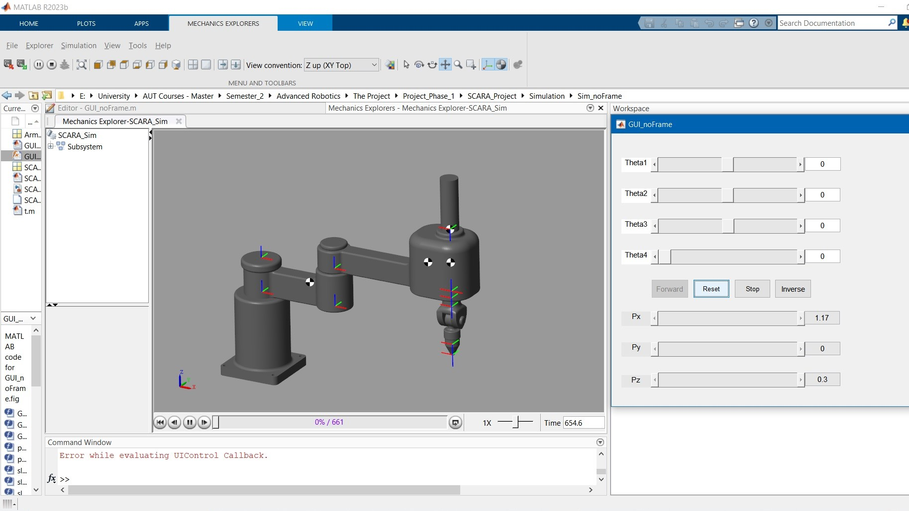
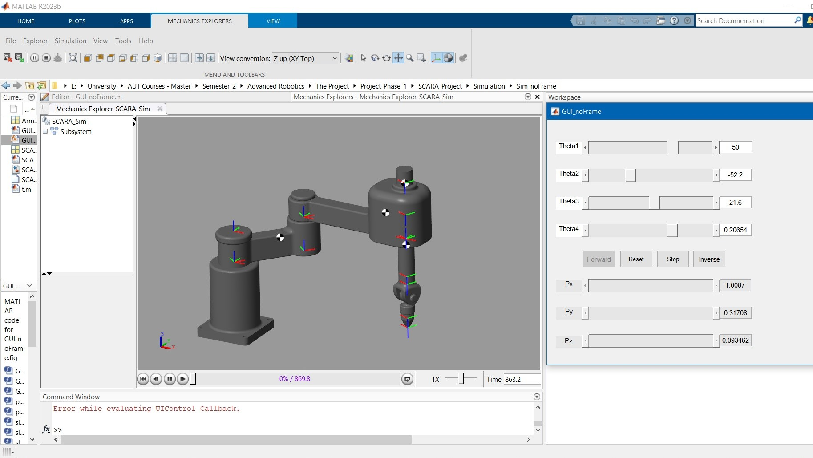
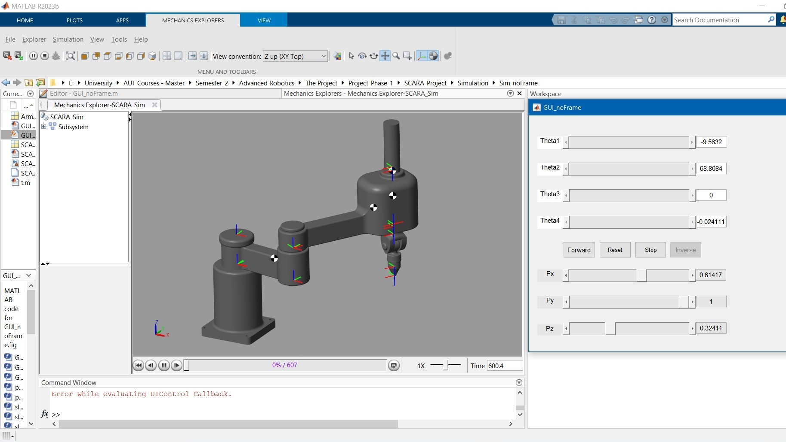
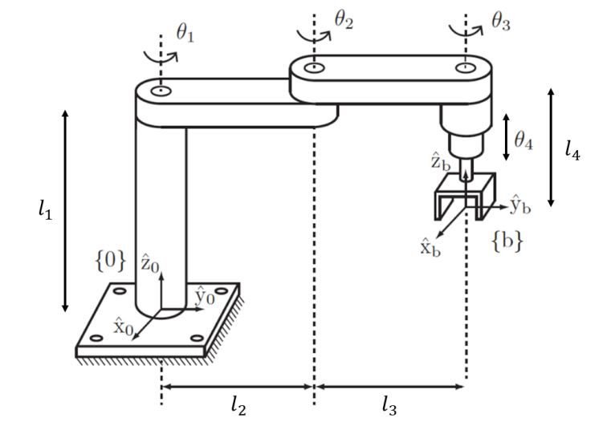

# 4-DOF SCARA Robotic Manipulator: Kinematics, Control & Simscape Simulation

An advanced, end-to-end engineering framework for the modeling, analytical derivation, and physical simulation of a 4-Degree-of-Freedom (4-DOF) SCARA (Selective Compliance Assembly Robot Arm) manipulator. This repository bridges theoretical robot kinematics with an interactive MATLAB GUI, custom test scripts, and a high-fidelity Simscape Multibody physics engine simulation.

The core design parameters and tasks are modeled based on research specifications from the Department of Electrical Engineering at Amirkabir University of Technology (Tehran Polytechnic).

---

## 🚀 Key Architectural Features

* **Rigorous Kinematic Modeling**: Fully developed closed-form mathematical equations for Forward and Inverse Kinematics based on successive homogeneous transformation matrices.
* **Interactive No-Frame GUI (`GUI_noFrame`)**: Real-time joint configuration sliders, coordinate mapping, workspace validation, and dynamic inversion safety checking.
* **Simscape Multibody Physics**: Direct synchronization between the mathematical joint space vector and a 3D physical rigid-body tree simulation environment.
* **CAD Integration & Material Profiling**: Seamless import capability for native 3D SolidWorks parts matching exact mass properties and structural constraints.

### Simscape Multibody 3D Environment
The physical plant layout and real-time rigid body dynamics are computed and visualized inside the Simulink Simscape Multibody mechanics explorer interface.


---

## 📊 Simulation Results & Visualizations

### 1. Interactive UI & Base Configuration
The custom-built MATLAB GUI allows real-time manipulation of joint spaces and immediate verification of the robot's zero-configuration state.



### 2. Kinematics Verification
Below are the graphical verifications demonstrating successful calculation tracks for both forward workspace coordinate mapping and closed-form analytical inverse solutions.

| Forward Kinematics Tracking | Inverse Kinematics Solvers |
| :---: | :---: |
|  |  |

---

## 📐 Kinematics & Mathematical Foundations

The manipulator consists of three revolute joints ($\theta_1$, $\theta_2$, $\theta_3$) and one prismatic joint ($\theta_4$). At the zero-configuration ($t=0$), all joint variables are initialized to zero, orienting the arm structure such that the third link sits exactly $0.3\text{ m}$ above the second link.

### 1. Link Dimensions & Structural Parameters
The corresponding digram and schematics of the model:


Based on the physical model blueprints and configuration script (`t.m`), the geometric parameters are explicitly defined as:



* $l_1 = 0.45\text{ m}$ (Base height offset along the $\hat{z}_0$ axis)
* $l_2 = 0.45\text{ m}$ (Length of Link 1)
* $l_3 = 0.72\text{ m}$ (Length of Link 2)
* $l_4 = 0.15\text{ m}$ (End-effector baseline offset)

### 2. Forward Kinematics (Successive Homogeneous Transformations)
To map local joint displacements to global Cartesian positions, successive homogeneous transformation matrices are evaluated sequentially from the base frame $\{0\}$ to the tool tip frame $\{4\}$:

$$T_1(\theta_1) = \begin{bmatrix} \cos\theta_1 & -\sin\theta_1 & 0 & l_2\cos\theta_1 \\ \sin\theta_1 & \cos\theta_1 & 0 & l_2\sin\theta_1 \\ 0 & 0 & 1 & l_1 \\ 0 & 0 & 0 & 1 \end{bmatrix}$$

$$T_2(\theta_2) = \begin{bmatrix} \cos\theta_2 & -\sin\theta_2 & 0 & l_3\cos\theta_2 \\ \sin\theta_2 & \cos\theta_2 & 0 & l_3\sin\theta_2 \\ 0 & 0 & 1 & 0 \\ 0 & 0 & 0 & 1 \end{bmatrix}$$

$$T_3(\theta_3) = \begin{bmatrix} \cos\theta_3 & -\sin\theta_3 & 0 & 0 \\ \sin\theta_3 & \cos\theta_3 & 0 & 0 \\ 0 & 0 & 1 & 0 \\ 0 & 0 & 0 & 1 \end{bmatrix}$$

$$T_4(\theta_4) = \begin{bmatrix} 1 & 0 & 0 & 0 \\ 0 & 1 & 0 & 0 \\ 0 & 0 & 1 & -l_4 - \theta_4 \\ 0 & 0 & 0 & 1 \end{bmatrix}$$

Multiplying these matrices yields the final composite transformation matrix ($T = T_1 \cdot T_2 \cdot T_3 \cdot T_4$). Isolating the upper-right position vector components defines the explicit end-effector positions in Cartesian space ($P_x, P_y, P_z$):

$$P_x = l_2\cos\theta_1 + l_3\cos(\theta_1 + \theta_2)$$

$$P_y = l_2\sin\theta_1 + l_3\sin(\theta_1 + \theta_2)$$

$$P_z = l_1 - l_4 - \theta_4$$

### 3. Step-by-Step Analytical Inverse Kinematics
Given a desired target position $(P_x, P_y, P_z)$ and a target end-effector orientation $\phi$, the corresponding joint spaces are analytically calculated to guarantee exact track positioning:

* **Solving for Joint 2 ($\theta_2$)**:
  Squaring and adding $P_x$ and $P_y$ isolates the planar configuration:
  $$P_x^2 + P_y^2 = l_2^2 + l_3^2 + 2l_2 l_3\cos\theta_2 \implies \cos\theta_2 = \frac{P_x^2 + P_y^2 - l_2^2 - l_3^2}{2l_2 l_3}$$
  $$\sin\theta_2 = \pm\sqrt{1 - \cos^2\theta_2}$$
  $$\theta_2 = \operatorname{atan2}(\sin\theta_2, \cos\theta_2)$$

* **Solving for Joint 1 ($\theta_1$)**:
  Using trigonometric subtraction identities, $\theta_1$ is isolated relative to the geometric target vector:
  $$\theta_1 = \operatorname{atan2}(P_y, P_x) - \operatorname{atan2}(l_3\sin\theta_2, l_2 + l_3\cos\theta_2)$$

* **Solving for Prismatic Joint 4 ($\theta_4$)**:
  Linear mapping from the vertical axis yields:
  $$\theta_4 = l_1 - l_4 - P_z$$

* **Solving for Joint 3 ($\theta_3$)**:
  $$\theta_3 = \phi - \theta_1 - \theta_2$$

---

## 📂 Project Repository Structure

| File / Folder | Type | Description |
| :--- | :--- | :--- |
| `GUI_noFrame.m` | MATLAB Code | Primary executable file controlling the graphical interface callback parameters and kinematics engine. |
| `GUI_noFrame.fig` | GUIDE Layout | User Interface window containing sliders, coordinate tracking displays, and model triggers. |
| `t.m` | Test Script | Analytical script handling symbolic verification, trajectory profiles, and workspace point-cloud plotting. |
| `SCARA_ROBOT_noFrame.m` | Automation | Automated script linking the rigid body tree environment using `importrobot('SCARA_Sim')`. |
| `SCARA_model_noFrame.mat` | Data Workspace | Pre-calculated physical rigid-body plant variables and structural object properties. |
| `Arminfo.mat` | Data Workspace | Consolidated mass parameters, linkage configurations, and joint definition spaces. |
| `SCARA_Sim.slx` | Simulink / Simscape | High-fidelity 3D multi-body physical block simulation model. |
| `Project1.pdf` | Document | Original course guidelines detailing task milestones and theoretical limits (translated from Persian). |
| `SCARA.pdf` | Blueprint | Manufacturing design specifications with structural link lengths and precision profiles (in mm). |
| `SCARA_CAD Model/` | Directory | Complete 3D CAD system assembly files. |
| `SCARA_project_SDLPRT_format/` | Directory | Native SolidWorks Part files (`.SLDPRT`) tracking separate individual linkages. |
| `outputs/` | Directory | Graphic validations showcasing project capabilities (`1-Base.jpg`, `2-Forward.jpg`, `3-Inverse.jpg`). |

---

## 🛠️ Operational Boundaries & Material Specs

To prevent mathematical singularities and structural degradation, the workspace limits are governed by the following strict boundaries:
* **Joint 1 Range ($\theta_1$)**: $[-125^\circ, 125^\circ]$
* **Joint 2 Range ($\theta_2$)**: $[-145^\circ, 145^\circ]$
* **Prismatic Range ($\theta_4$)**: $[0\text{ m}, 0.3\text{ m}]$
* **Rigid Body Masses**:
  * Base Plant: $5257.95\text{ g}$
  * Link 1: $2195.03\text{ g}$
  * Link 2: $5177.21\text{ g}$
  * End-Effector Mechanism (Links 4, 5, 6 combined structurally into a unified single unit): $2964.66\text{ g}$

---

## 💻 Running the Environment

1. Clone this repository onto your workstation.
2. Launch **MATLAB** (R2021a or newer recommended) and make sure the **Simscape Multibody** toolbox is installed.
3. Add this project's directory to your MATLAB active path.
4. Open the GUI dashboard via the Command Window:
   ```matlab
   run('GUI_noFrame.m')